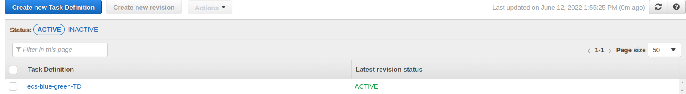

# AWS ECS Pipeline Deployment - Assignment


**Step1: Create ECS clusters**
First, we created an ECS cluster named "ecs-app-cluster" with Registered container instances 1


<br />

**Step2: Create ECR Repository for app image**


We then need to authenticate and push our dockerized application into this ECR repository
Commands for authenticating and pushing docker image into ECR:

1. Retrieve an authentication token and authenticate your Docker client to your registry using the AWS CLI:

```
aws ecr get-login-password --region us-west-2 | docker login --username AWS --password-stdin xxxxxxxxxx.dkr.ecr.us-west-2.amazonaws.com
```
2. Build your Docker image using the following command
```
docker build -t server-image .
```
3. After the build completes, tag your image so you can push the image to this repository:
```
docker tag server-image:latest xxxxxxxxxx.dkr.ecr.us-west-2.amazonaws.com/server-image:latest
```
4. Run the following command to push this image to your newly created AWS repository
```
docker push xxxxxxxxxx.dkr.ecr.us-west-2.amazonaws.com/server-image:latest
```
After pushing our docker image into ECR you can see it here in repositories.

<br />

**Step3: Create Task Definition & Service for Running Container in ECS Cluster**

We first add a container in our task definition and then create it.



**Step4: Configure Service in ECS**


<br />

**Step 5: Create Pipeline using CodePipeline, CodeBuild & CodeDeploy**


**CodeBuild for Building the App**


**CodeDeploy for Deploying the App**


<br />

**Step 6: Create Load Balancer with 2 Target Groups (Blue app/green app)**

Application Load Balancer for Routing traffic from different container instances
Note: we can access the application from LB Dns: [ALB DNS](http://ecs-app-lb-1477482267.us-west-2.elb.amazonaws.com/)


<br />

Target Groups for registering the container instances in our EC2


<br />

In our ECS Service task section, We can access our application from container using provided IP [IP](http://ecs-app-lb-1477482267.us-west-2.elb.amazonaws.com/)


<b>Note: This project is not running right now due to extra bill occuring in my AWS account.</b>


